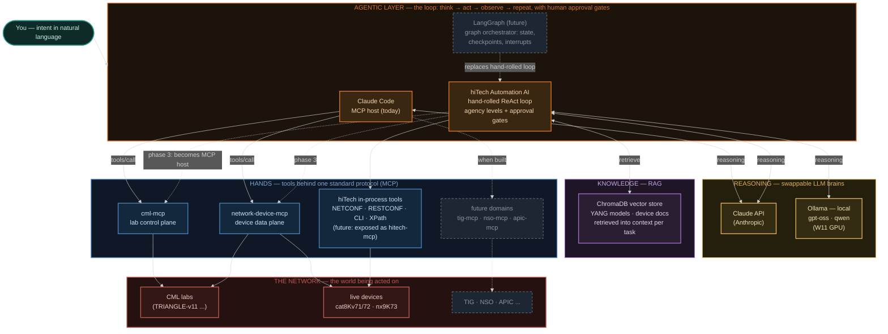
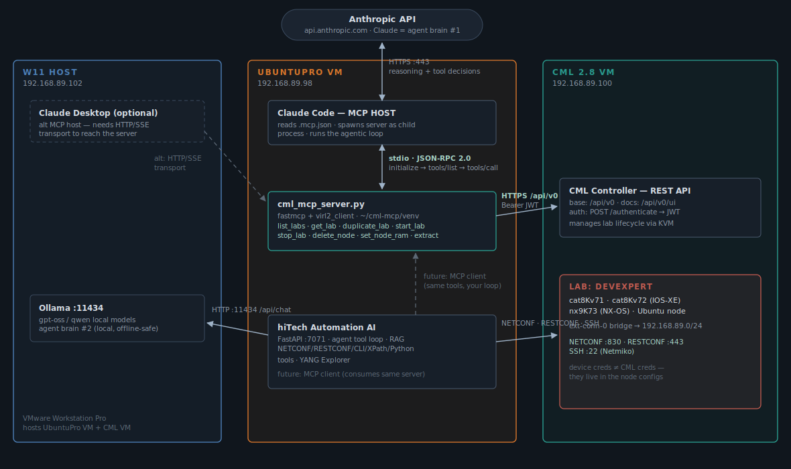
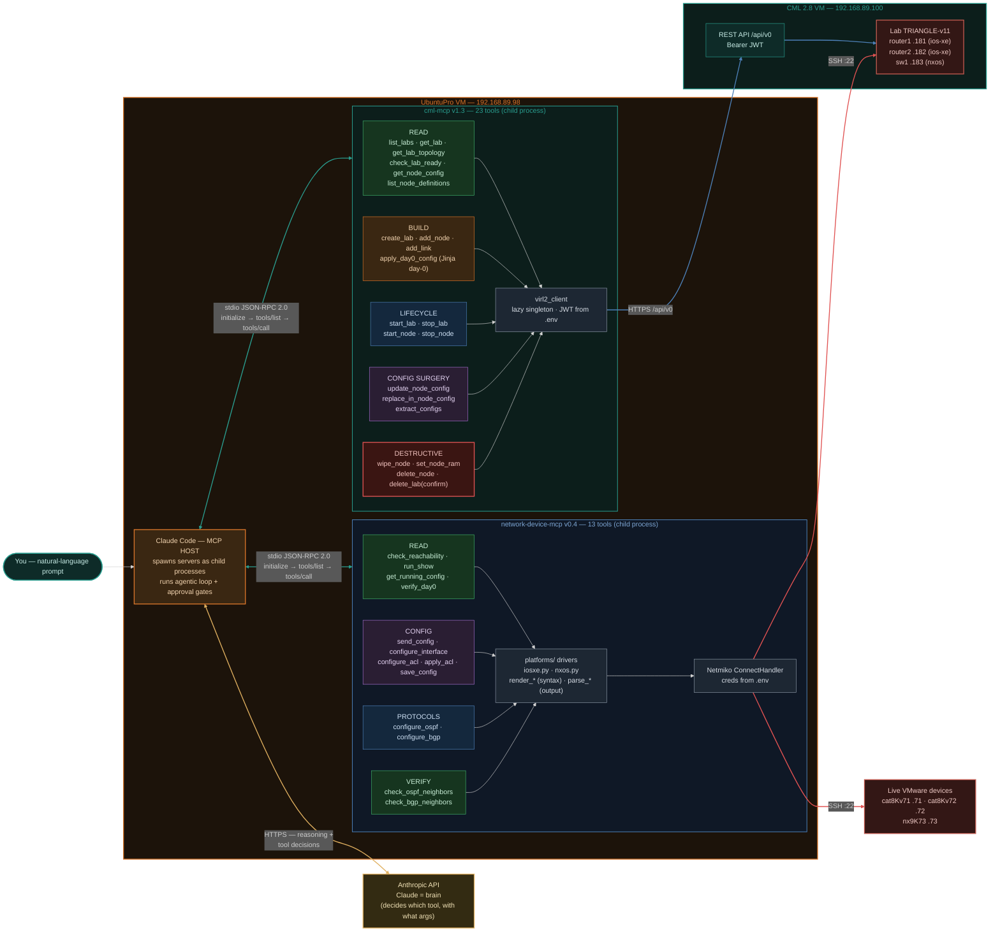
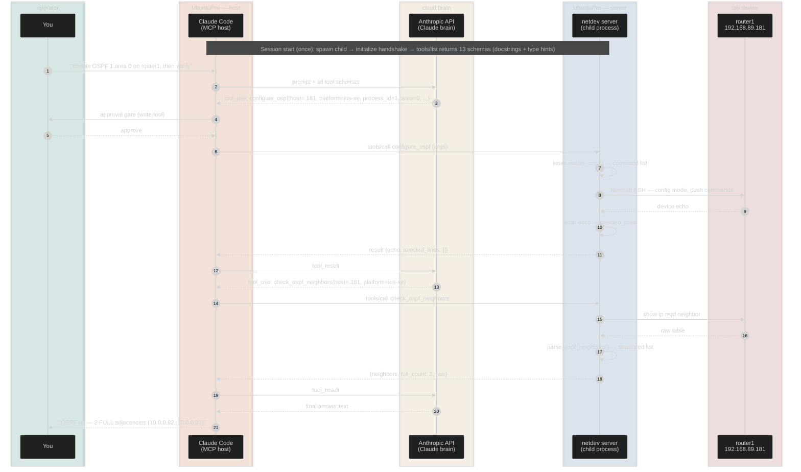

# Architecture — MCP-driven network automation lab

Two MCP servers, one agentic host, a swappable-brain design. This document is
the GitHub-renderable version of `mcp_architecture.html` (same content, native
mermaid). Diagrams: high-level AI picture → machine topology → as-built tool
map → one tool call on the wire.

## 00 · The whole AI picture — where everything sits

Human intent on top, an **agentic layer** running the think→act→observe loop,
swappable **LLM brains**, **RAG** as retrievable knowledge, **MCP servers as
the hands**, and the network as the world being acted on. Solid = built and
running; dashed = planned evolution.

**The separation of roles is the design:** brains are swappable (Claude ↔
Ollama per task), orchestrators are swappable (hand-rolled ReAct loop today,
LangGraph when complexity justifies it), and hands are standardized — any MCP
host can drive any MCP server, so tools are written once and reused
everywhere. RAG feeds knowledge into the loop; approval gates keep a human
between decision and destructive action.

## 0b · Machine topology

Three machines, two credential boundaries, one bridged lab network:

## 01 · One prompt, end to end

What happens on `duplicate lab DEVEXPERT as DEVEXPERT-lite`:

1. **Startup (once):** the host reads its MCP config, spawns each server as a
   child process, sends `initialize`, then `tools/list` — servers reply with
   every tool's name, description and JSON schema.
2. Prompt + tool schemas go to the LLM, which decides the first call
   (`list_labs` to resolve title → id).
3. Host sends `tools/call` over **stdio** to the server.
4. Server calls the backing API (CML REST with cached JWT / Netmiko SSH) and
   returns the result as tool output.
5. The LLM chains further calls; **write tools pause at the host's approval
   gate** — the human-in-the-loop.
6. Result feeds back; loop repeats until the LLM writes the final answer.

Same ReAct loop as any agent framework — over a standard protocol.

## 02 · MCP protocol — the wire itself

JSON-RPC 2.0 over the child process's stdin/stdout:

| Method | Direction | Purpose |
|---|---|---|
| `initialize` | host → server | Handshake: protocol version, capabilities, identities |
| `notifications/initialized` | host → server | Handshake complete |
| `tools/list` | host → server | Tool catalog: name, description, `inputSchema` (generated by fastmcp from type hints + docstrings) |
| `tools/call` | host → server | Execute one tool: `{name, arguments}` → result content or `isError` |
| `resources/*` · `prompts/*` | host → server | Optional extras — unused here |

## 03 · As-built architecture — both servers, all 36 tools

**cml-mcp v1.3** (23 tools, lab control plane) and **network-device-mcp v0.4**
(13 tools, device data plane). One host, two credential boundaries. Tool
groups are color-coded by risk: green = read, blue = lifecycle/protocols,
orange = build, purple = config surgery, red = destructive.

## 04 · One tool call on the wire — configure + verify

The full round trip for "enable OSPF on router1 and verify": brain decision,
approval gate, stdio JSON-RPC, platform renderer, SSH push, echo scan, then
the chained verification call with parsed results.

## Design doctrine (extracted from the build)

- Dangerous sequences are **atomic tools** — the LLM cannot reorder or skip
  safety steps (`set_node_ram`: extract → verify → wipe → patch).
- **Bulk data stays server-side** (`replace_in_node_config`) — agents route
  around tools that force large payloads through the model.
- **Errors are data**: structured `{"error": ...}` results with valid
  options listed let the agent self-correct in one step.
- **Docstrings are the agent-facing API** — usage order, warnings and refusal
  instructions live there.
- **Verify, don't assume**: config tools self-verify; check tools return
  parsed *and* raw so fields can be reconciled, not just counts.
- The MCP boundary is a **convenience boundary, not a security boundary** —
  credential isolation requires an OS boundary; the real gates are host
  approval prompts.
